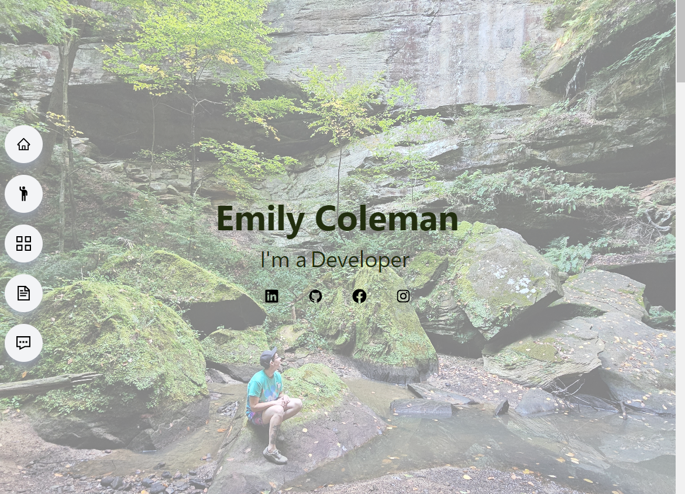

# React Portfolio

## Description

This is my professional Portfolio built using React, Vite, and Tailwind CSS. There is navigation for the application either on the sidenav or the nav list depending on screen size. The Portfolio section displays images of the application which can be clicked on to see the live application or walk-throught video. The user is also able to click on "GitHub Repo" to route them directly to that project's repository. In the Resume section there is a download icon that the user can click on to be routed directly to my Resume. I used Getform for the contact form. 

## Usage

Screenshot: 

Link:

https://emilycoleman.netlify.app/

## Credits

https://www.youtube.com/watch?v=22CxRxryQFE

https://v2.tailwindcss.com/docs

https://react-icons.github.io/react-icons/

https://www.npmjs.com/package/react-type-animation

https://docs.getform.io/

https://legacy.reactjs.org/docs/events.html#form-events

https://coolors.co/

Asked questions on https://chat.openai.com/ to help troubleshoot situations where I was stuck.
